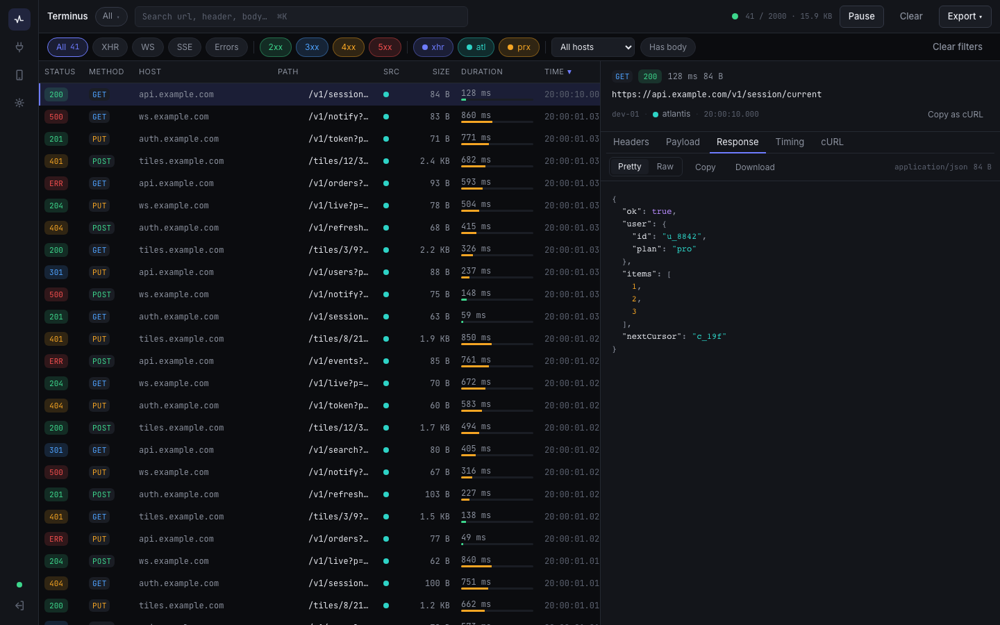
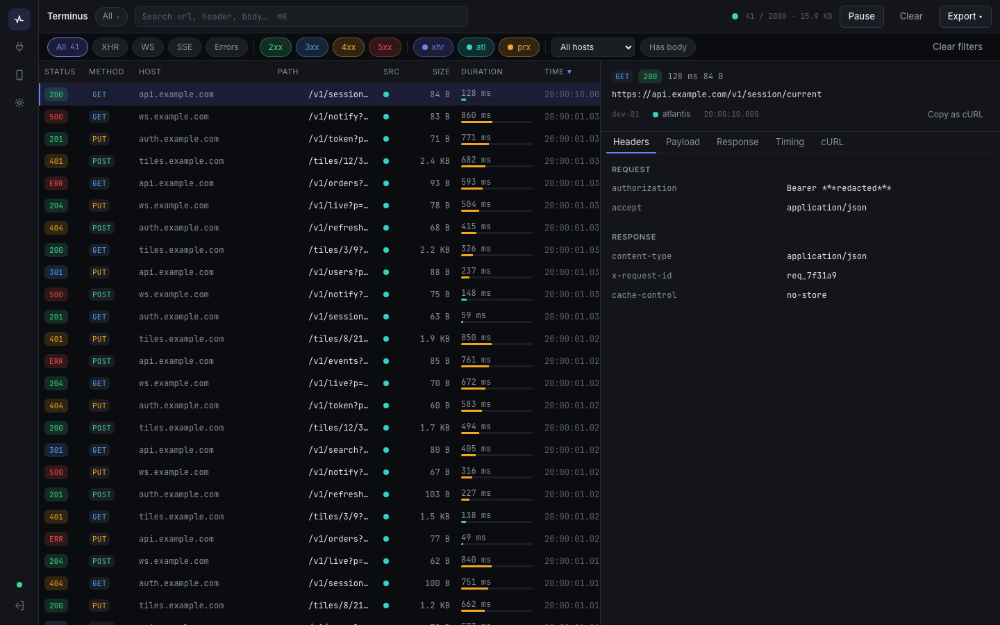
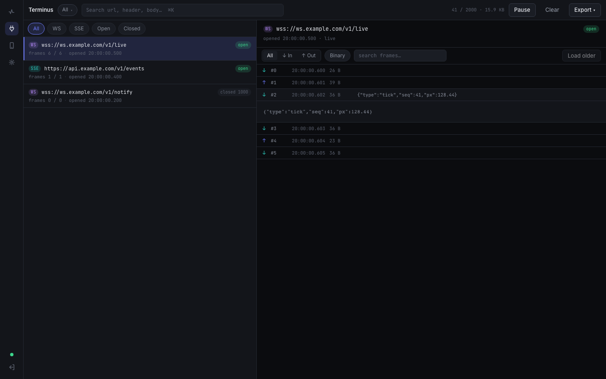
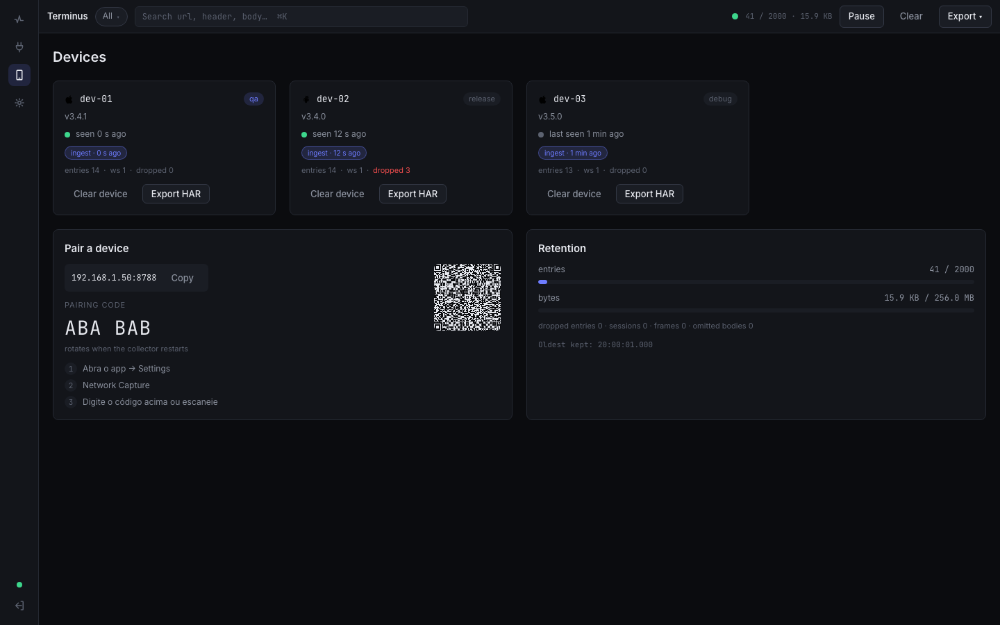

# Terminus

Terminus is a local Mac collector that captures HTTP and WebSocket/SSE traffic
from your devices on the LAN, shows it live in a loopback web UI, and exports it
as HAR 1.2 or JSON. It is built for mobile and device developers who want to see
exactly what their app puts on the wire, over TLS with per-device authentication,
without routing traffic through a third-party service.



## Quick start

Terminus is an npm-workspaces monorepo (`collector/` + `cli/`). Install and run it
from the repository root:

```bash
npm ci                          # installs both workspaces from the root lockfile
npm start                       # builds, then serves the UI on http://127.0.0.1:8787
npm run build -w @terminus/cli  # optional: build the terminus CLI
```

`npm start` prints a URL carrying a one-time admin token; open it to reach the UI,
then pair a device from the Devices screen (paste the pairing blob or scan the QR).
See the [collector README](collector/README.md) for capture protocols, pairing,
exports, and every environment override, and the [CLI README](cli/README.md) for the
terminal client.

## Screenshots

The capture dashboard is shown above. A few more views:

| Request detail | Sockets (WS/SSE) | Devices & pairing |
|---|---|---|
|  |  |  |

More views (timing, login, empty, paused, command palette) are in
[docs/screenshots/](docs/screenshots/).

## Command-line client

`terminus` is a terminal client for the collector — everything the dashboard does,
without a browser: live tail, list, inspect, export, pause, devices, and pairing
(with a QR rendered in the terminal). It talks to the collector's HTTP/WebSocket
API on `127.0.0.1:8787` and authenticates from the `admin-token` file the running
collector writes, so on the same machine no token needs to be copied.

```bash
npm install                       # installs both workspaces (collector + cli)
npm run build -w @terminus/cli    # emits cli/dist/cli/src/cli.js
node cli/dist/cli/src/cli.js status
```

The examples below use the bare `terminus` command, which assumes it is on your
`PATH` — see [Getting `terminus` on your PATH](cli/README.md#getting-terminus-on-your-path)
in the CLI README (`npm install -g ./cli`, `npm link`, or run the built entry
directly). Until then, substitute `node cli/dist/cli/src/cli.js` for `terminus`:

```bash
terminus tail --status 4xx,5xx    # follow failing traffic live (Ctrl-C to stop)
terminus ls --device pixel-8      # list captured entries
terminus show pixel-8/<key> --curl
terminus export --har -o capture.har
terminus pair --qr                # scannable QR (contains the device token)
```

See the [cli/README.md](cli/README.md) for every command, filter, and exit code.

## Documentation

- [collector/README.md](collector/README.md) — running the collector, capture
  protocols, pairing, and exports
- [cli/README.md](cli/README.md) — the command-line client
- [docs/architecture.md](docs/architecture.md) — listeners, capture flow, pairing,
  state, and the optional proxy
- [docs/security.md](docs/security.md) — trust model, authentication, redaction,
  and residual risks
- [docs/ingest-protocol.md](docs/ingest-protocol.md) — the WSS capture protocol,
  for instrumenting your own app without the Atlantis SDK
- [docs/troubleshooting.md](docs/troubleshooting.md) — pairing, network, port, and
  auth failures and their fixes

## Attribution

Terminus speaks the Atlantis wire protocol by Proxyman LLC (Apache-2.0) so the
existing Atlantis iOS/Android forks can connect to it. No code was copied; only
the wire protocol is implemented.

## License

MIT — see [LICENSE](LICENSE).
